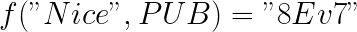
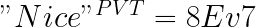
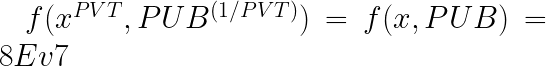
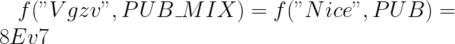

This is an attempt to convey the concept of encrypted search to non-cryptographers. Please excuse the lack of rigour for which I will compensate at the end of the article.

Assume you have a public key encryption system.

Let’s say you wanted a third-party to verify whether an encrypted text matches a search string, without 
1. decrypting the encrypted text or 
2. encrypting the search string

Let’s say encryption("Nice") = 8Ev7

How can a third-party verify that "8Ev7" is actually "Nice" in encrypted form ?

What you need here is an auxiliary string called a "trapdoor" which the third-party can use to verify the equality

This problem is solved using a bilinear map, which enables two different ways of producing same encrypted text

A bilinear map is a function of two variables f(x, y) satifying this condition

Lets say you have
1. public key = PUB
2. private key = PVT

Let x be the text to be encrypted

The encrypted text is generated using f(x, y).

Now you have to generate an extra string called the trapdoor in the form of "x^PVT"

and

Now by the property of a bilinear map, the PVT multiplication and division cancels out giving

So you have two ways of producing the same encrypted text !!

If you give this string "Vgzv" along with the modified public key (y^PVT) to the third-party, they can verify the equality

This is intuitively the first cryptographic construction produced by Boneh and Franklin in their paper

Alright, I have played fast and loose here to provide intuition, lets define it with more rigour

The trapdoor construction is more complex and cryptographically secure, to prevent the third-party from guessing the original text.

